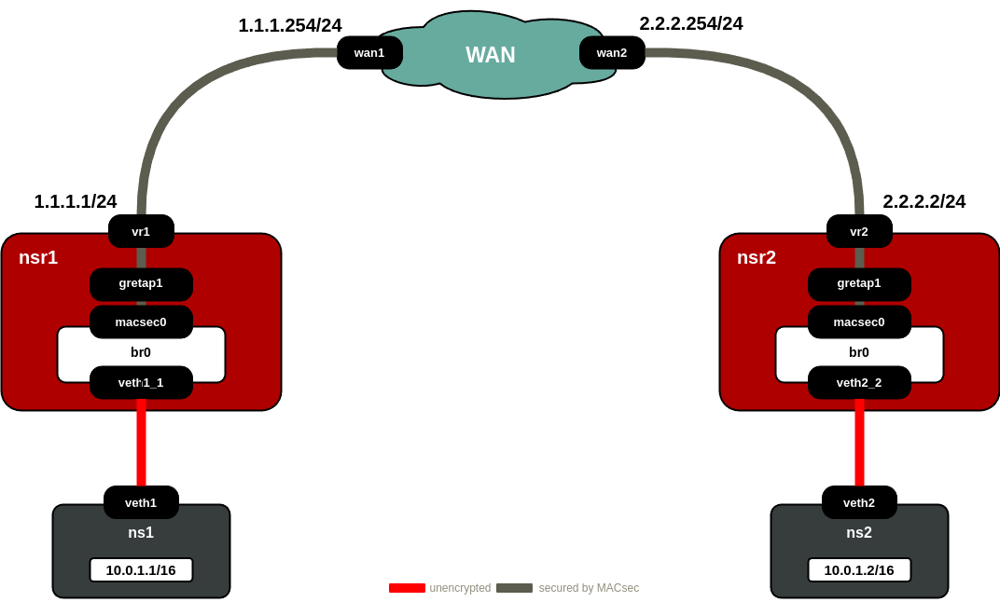

# MACsec applied to LAN and WAN topologies

## Overview 
This repository contains two bash scripts designed to simulate **MACsec (IEEE 802.1AE)** protocol over **LAN** and **WAN** topologies using network namespaces in the context of a single Linux environment. Both scripts help to set up a MACsec protected network simulating two different scenarios:

- **MACsec over LAN**: virtual Ethernet interfaces are created and bridged to form a virtual LAN, where MACsec-protected communications can take place between a chosen number of host namespaces. This simulation leverages the use of the **MACsec Key Agreement (MKA)** protocol with the help of **wpa_supplicant**. 

- **MACsec over WAN**: multiple namespaces, each representing hosts connected to virtual routers and interconnected within a WAN, are configured to simulate MACsec-protected communication over a Layer 2 GRE tunnel (**GRETAP**). This setup conceptually secures the traffic between two remote sites, mimicking a **site-to-site VPN at Layer 2**, with the added security of the MACsec protocol over the WAN link.

Both scripts provide logging with rotation enabled and include options for environment teardown and direct namespace access. 

**Note:** You can find a comprehensive report explaining how MACsec works, along with a step-by-step tutorial to manually reproduce and configure the simulation provided by these automated scripts, in the `docs` folder. The report is available in the [MACsec_Report.pdf](https://github.com/eferollo/MACsec-Demo/blob/main/docs/MACsec_Report.pdf) file.

## Requirements

Both scripts are intended to be executed on a Linux machine and the following packages have to be installed on your system to work:

- Linux kernel $\geq$ 4.7.0
- Netlink library libnl $\geq$ 3.2.29
- wpa supplicant $\geq$ 2.6
- ip-route2 
- logrotate
- tcpdump
- konsole

You must run all the scripts located in the `src/` folder with root privileges (either using `sudo` or running as root).

## Usage

Inside the `src/` folder, you can find two shell scripts:

- `lan_macsec.sh`: This script replicates the LAN simulation.
- `wan_macsec.sh`: This script replicates the WAN simulation.

Additionally, there is a python code named `benchmark_plot.py` useful for perfoming bandwidth tests using `iperf3`. More details can be found at the beginning of the code. 

### 1. Clone the Repository:

```
git clone https://github.com/eferollo/MACsec-Demo.git
cd MACsec-Demo
```

### 2. Make the Scripts Executable:

```
chmod +x wan_macsec.sh
chmod +x lan_macsec.sh
```

### 3. Run the Scripts

For example:
```
sudo ./wan_macsec.sh
```
or
```
sudo ./lan_macsec.sh
```
**Note**: For the LAN simulation, carefully check the `wpa_supplicant.conf` file for configuring wpa_supplicant operation mode. A default configuration file is provided but it can be modified according to your needs.

## MACsec over LAN simulation


After starting the script, you will be prompted to enter the number of namespaces to create. Input the desired number (e.g., 2 for two namespaces):

```
Enter the number of network namespaces: 2
```

### Open Shell in Each Namespace

he script will then ask if you would like a `konsole` terminal window for each namespace. This allows direct interaction within each namespace:

```
Do you want to open a shell in each namespace? (y/n): y
```

Entering `y` opens a `konsole` window for each namespace. Selecting n will skip this, but instructions to manually access each namespace will be provided.

### Starting MACsec and MKA

Once the namespaces and interfaces are set up, the script will prompt you to press `Enter` to initialize the MACsec and MKA protocols:

```
Simulating MACsec environment, press enter to start MKA and MACsec...
```

### Viewing Logs and Namespace Details

The script includes a menu for managing namespaces and logs. Upon running the script, a `log` directory is automatically created in the current working directory. This directory stores various logs generated during the setup and operation of the network namespaces and MACsec configuration. Below is a description of each log type you will find:

- **WPA Supplicant Logs** (`wpa_supplicant_nsX.log`):  
  These logs are generated by `wpa_supplicant` for each namespace (where `X` is the namespace number). They provide detailed debug information about the MACsec Key Agreement (MKA) protocol operations, security association setups, and any issues encountered by `wpa_supplicant`.
    
- **Interface Capture Logs** (`eth0_nsX.pcap`):  
  For each namespace, a `.pcap` file is generated to capture packets on the `eth0` interface. These captures include traffic using MACsec encryption protocols, specifically focusing on frames with EtherTypes `0x888E` (EAPOL frames) and `0x88E5` (MACsec secured data). You can analyze these with tools such as Wireshark or `tcpdump`.
    
- **RTNETLINK Log** (`rtnetlink.log`):  
  This log tracks changes to network interfaces and addresses in the system using `rtnetlink`. It monitors all network events across namespaces, providing insight into link, address, and route changes crucial for network troubleshooting.

The logs are automatically rotated to prevent excessive disk usage. Each log type is limited to a maximum of 10 rotated files, ensuring older logs are archived while keeping recent information readily available.

To view any of these logs, navigate to the `lan_logs` directory created within the directory where the script is executed:

### Menu controls

To list all namespaces and view MACsec information, use the options below:

```
Select an option: list
Select an option: show
```

When you’re done, select `exit` from the menu. This will:

 - Stop all running wpa_supplicant processes.
 - Remove all network interfaces.
 - Delete namespaces and the bridge.

## MACsec over WAN simulation



After starting the script, you’ll be prompted to make two key choices:

1. **Open a Shell in Each Namespace**:  
   If you select "yes," the script will open a shell for each namespace in separate terminals. This allows you to interact directly with each namespace.  

2. **Enable MACsec Encryption**:  
   You’ll have the option to toggle MACsec encryption. If enabled, MACsec will secure network communications between namespaces using randomly generated keys.

### Logging and Log Files

The script creates detailed logs for each network interface within the namespaces. All log files are saved in the `wan_logs` directory, with specific subdirectories based on the namespace type:

- **`wan_logs/hosts`**: Logs for host namespaces (`ns1` and `ns2`), which are created for each veth (virtual Ethernet) interface.
- **`wan_logs/routers`**: Logs for router namespaces (`nsr1` and `nsr2`). Each router has logs for multiple interfaces, including veth, GRE, and (if enabled) MACsec.
- **`wan_logs/wan`**: Logs for WAN interfaces (`wan1` and `wan2`) in the WAN namespace.

Each subdirectory contains `.pcap` (packet capture) files for individual interfaces, which can be analyzed using tools like `tcpdump` or `Wireshark`.

An example of log locations are:

- **Host Namespace Logs**:
  - `wan_logs/hosts/ns1_veth1.pcap` for the `veth1` interface of `ns1`
  - `wan_logs/hosts/ns2_veth2.pcap` for the `veth2` interface of `ns2`

- **Router Namespace Logs**:
  - `wan_logs/routers/nsr1_veth1_1.pcap` for the `veth1_1` interface of `nsr1`
  - `wan_logs/routers/nsr2_macsec.pcap` (if MACsec is enabled)

- **WAN Namespace Logs**:
  - `wan_logs/wan/wan1.pcap` for the `wan1` interface in the WAN namespace

The script includes a **log rotation** function that prevents the log files from growing indefinitely. The rotation policy retains the last 10 logs for each interface. You can configure log rotation settings in the configuration files generated by the script in each logging directory.  

### Menu controls

To list all namespaces and view MACsec information, use the options below:

```
Select an option: list
Select an option: show
```

When you’re done, select `exit` from the menu. This will:

 - Bring down the GRETAP tunnel and MACsec context.
 - Remove all network interfaces.
 - Delete namespaces and the bridge.

## Direct access to namespaces

If you skipped the console option, you can manually access each namespace as follows:

```
sudo ip netns exec <name> bash
```